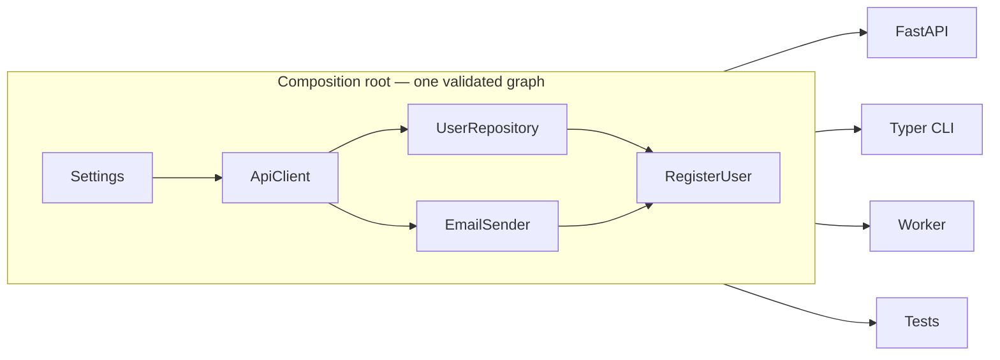

# Injex

[](https://github.com/vshulcz/injex/actions/workflows/ci.yml)
[](https://pypi.org/project/injex/)
[](https://pepy.tech/project/injex)
[](https://codecov.io/gh/vshulcz/injex)
[](https://pypi.org/project/injex/)
[](./LICENSE)
[](https://scorecard.dev/viewer/?uri=github.com/vshulcz/injex)

**Tiny typed dependency injection for Python that catches missing dependencies and
cycles _before_ your app starts — with zero runtime dependencies.**

You wire one service graph at startup, validate it in a single call, then reuse it
from FastAPI, Typer, workers, scripts, and tests. Application classes stay plain:
normal constructors, normal type hints, no decorators.


```bash
pip install injex
```

## Quick start

```python
from injex import Container


class UserRepository:
    def save(self, email: str) -> int:
        return 42


class EmailSender:
    def send_welcome(self, email: str) -> None:
        print(f"Welcome, {email}")


class RegisterUser:
    def __init__(self, repo: UserRepository, email_sender: EmailSender):
        self.repo = repo
        self.email_sender = email_sender

    def execute(self, email: str) -> int:
        user_id = self.repo.save(email)
        self.email_sender.send_welcome(email)
        return user_id


container = Container()
container.add_singleton(UserRepository)
container.add_singleton(EmailSender)
container.add_transient(RegisterUser)

container.assert_valid()  # fail fast if the graph is incomplete

container.resolve(RegisterUser).execute("ada@example.com")
```

## What makes it different

Most small DI containers stop at "resolve a graph." Injex's distinctive feature is
that it can **check the whole graph without constructing anything**, so missing
registrations, missing annotations, and cycles surface at startup or in CI — not on
the first request or background job.

```python
errors = container.validate()       # list of problems, nothing constructed
container.assert_valid()            # or raise with all of them at once
```

That makes it safe to run as a startup guard even when real constructors open
sockets or files.

## Lifetimes, overrides, scopes

```python
container.add_singleton(ApiClient)     # one instance for the app lifetime
container.add_transient(UseCase)       # a new instance per resolve
container.add_scoped(RequestContext)   # one instance per scope (request/job)

# Swap a dependency inside a test, restored automatically on exit:
with container.override(EmailSender, instance=fake_sender):
    container.resolve(RegisterUser).execute("test@example.com")
```

See the [tutorial](./docs/tutorial.md) for factories, named registrations,
`resolve_all()`, optional dependencies, and property injection.

## Wire functions, not just classes

`call()` invokes any function with its annotated parameters injected, while you
pass the rest — a request, parsed args, a message. It's the building block for
handlers and commands without turning them into classes:

```python
def register_user(email: str, use_case: RegisterUser) -> int:
    return use_case.execute(email)

container.call(register_user, email="ada@example.com")  # use_case is injected
```

**FastAPI** — `injex.ext.fastapi` opens a scope per request and injects into routes
(`pip install injex[fastapi]`):

```python
from injex.ext.fastapi import Provide, setup_injex

setup_injex(app, container)

@app.post("/users")
async def create(use_case: RegisterUser = Provide(RegisterUser)):
    return use_case.execute(...)
```

**Typer / Click** — `injex.ext.cli` injects services; the CLI framework only sees
the real arguments:

```python
from injex.ext.cli import Inject, wire

@app.command()
@wire(container)
def register(email: str, use_case: RegisterUser = Inject()):
    use_case.execute(email)
```

**Larger apps** — mark classes with `@injectable` and register them in one call:

```python
from injex import injectable

@injectable(lifestyle="singleton")
class ApiClient: ...

container.scan(myapp.services)  # registers every @injectable defined there
```

## When to use it

- A service layer reused by an API, CLI, worker, and tests, where copy-pasted
  wiring drifts out of sync.
- You want a missing or cyclic dependency to fail at startup, not at 3 AM.
- Tests should replace one real service with a fake without touching production
  wiring.

**When not to:** a handful of constructor calls in one entrypoint is clearer with
plain manual wiring — reach for Injex when that wiring starts repeating.

## Async

Injex resolves async dependencies too. Register an `async def` factory or an
async-generator resource and resolve it through `aresolve()` / `ascope()`:

```python
async def db_session(settings: Settings):  # async-generator resource
    pool = await open_pool(settings.database_url)
    try:
        yield pool
    finally:
        await pool.aclose()  # finalized when the scope exits

container.add_scoped_factory(Pool, db_session)

async with container.ascope() as scope:
    pool = await scope.aresolve(Pool)
```

Resources are finalized LIFO via the standard library's `AsyncExitStack` (still
zero runtime deps). The sync `resolve()` raises `AsyncResolutionRequiredException`
if the graph needs async work, so you never silently get an un-awaited object. See
[async resolution](./docs/async.md) and the
[FastAPI example](./examples/fastapi_async.py).

## Scope and non-goals

Injex stays small on purpose. Its one deliberate non-goal:

- **No config-provider DSL.** Configuration is just another dependency: register a
  settings object with `add_instance`, or individual values as named registrations
  (`add_instance(str, dsn, name="database_url")`, injected with
  `Annotated[str, Named("database_url")]`). Loading and coercing config from
  env/files is left to tools built for it (`pydantic-settings`).

Framework wiring it *does* do: [`injex.ext.fastapi`](./docs/fastapi-depends.md)
injects services into FastAPI routes, and `container.call(fn, ...)` injects into
any function — Typer/Click commands, workers, message handlers.

## Performance

Injex compiles and caches a flat creator per service graph. On a small synthetic
graph (singleton config + client, transient repository/service/use-case) it resolves
faster than several popular containers on the same machine:

| Library | Median resolve time |
| --- | ---: |
| manual wiring | `0.266 µs/op` |
| **Injex** | **`0.333 µs/op`** |
| dishka | `0.786 µs/op` |
| Wireup, same scope | `0.872 µs/op` |
| dependency-injector | `1.709 µs/op` |
| lagom | `9.487 µs/op` |
| punq | `56.982 µs/op` |

This is synthetic and graph-specific — **not** a universal ranking. Reproduce it:

```bash
uv run --with punq --with lagom --with dependency-injector --with wireup --with dishka \
  python benchmarks/resolve_graph.py
```

See [performance notes](./docs/performance.md) for the full table and method.

## How it fits

One validated graph at the composition root; every entrypoint resolves from it.



## How it compares

| Feature | Injex | dependency-injector | punq | lagom |
| --- | ---: | ---: | ---: | ---: |
| Zero runtime dependencies | ✅ | ❌ | ✅ | ✅ |
| Type-hint constructor injection | ✅ | ✅ | ✅ | ✅ |
| Singleton / transient / scoped | ✅ | ✅ | partial | ✅ |
| Named registrations | ✅ | ✅ | ❌ | ✅ |
| Property injection | ✅ | ❌ | ❌ | ❌ |
| Temporary test overrides | ✅ | ✅ | ❌ | ✅ |
| **Graph validation without constructing services** | ✅ | ❌ | ❌ | ❌ |

This table contrasts Injex with the minimal containers. For an honest head-to-head
with the modern full-featured ones — **dishka** and **Wireup** — see
[compared to larger DI frameworks](./docs/di-frameworks.md) and the
[comparison guide](./docs/comparison.md).

## API at a glance

| Method | Use when |
| --- | --- |
| `add_singleton/transient/scoped(T, Impl)` | Register a class for the chosen lifetime. |
| `add_*_factory(T, factory)` | Construction needs custom code; a generator factory becomes a resource with teardown. |
| `add_instance(T, instance)` | You already have the object. |
| `scan(module)` | Register every `@injectable` class in a module. |
| `resolve(T)` / `resolve_all(T)` | Resolve one, or all unnamed implementations. |
| `call(fn, **overrides)` | Invoke a function with its dependencies injected. |
| `create_scope()` | Start a request/job lifetime (`with` finalizes scoped resources). |
| `override(T, ...)` | Temporarily replace a dependency in tests. |
| `validate()` / `assert_valid()` | Check wiring before startup. |
| `aresolve(T)` / `ascope()` / `acall(fn)` / `aclose()` | Async equivalents (await factories, async resources). |
| `close()` | Finalize singleton resources at shutdown. |

## Documentation

- [Docs site](https://vshulcz.github.io/injex/) · [Tutorial](./docs/tutorial.md) ·
  [API reference](./docs/api.md)
- [Validation guide](./docs/validation.md) ·
  [Comparison](./docs/comparison.md) ·
  [vs FastAPI Depends](./docs/fastapi-depends.md)
- [Recipes](./docs/recipes.md) ·
  [Migrating from a factories module](./docs/migrating-from-factories.md) ·
  [Performance](./docs/performance.md)
- Examples:
  [clean architecture](./examples/clean_architecture.py),
  [FastAPI integration](./examples/fastapi_ext.py),
  [CLI injection](./examples/cli_injection.py),
  [config injection](./examples/config_injection.py),
  [async FastAPI](./examples/fastapi_async.py),
  [testing](./examples/testing.py),
  [scopes](./examples/scoped.py)

## Contributing

Contributions are welcome when they keep the API small, tested, and dependency-free.
Useful changes usually improve documentation, typing, examples, or narrow edge cases.
See [CONTRIBUTING.md](./CONTRIBUTING.md).

Thanks to [Muhammad Saqib Atif](https://github.com/msaqibatifj),
[mahek](https://github.com/mahek56),
[oppnc](https://github.com/oppnc),
[YuuGR1337](https://github.com/YuuGR1337), and
[ankitaparasher04](https://github.com/ankitaparasher04) for improving Injex.
